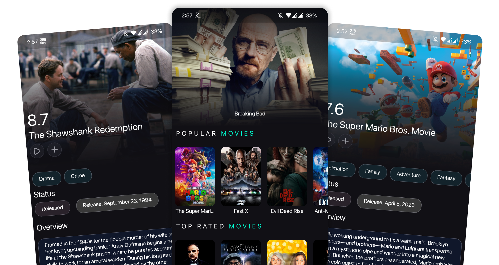
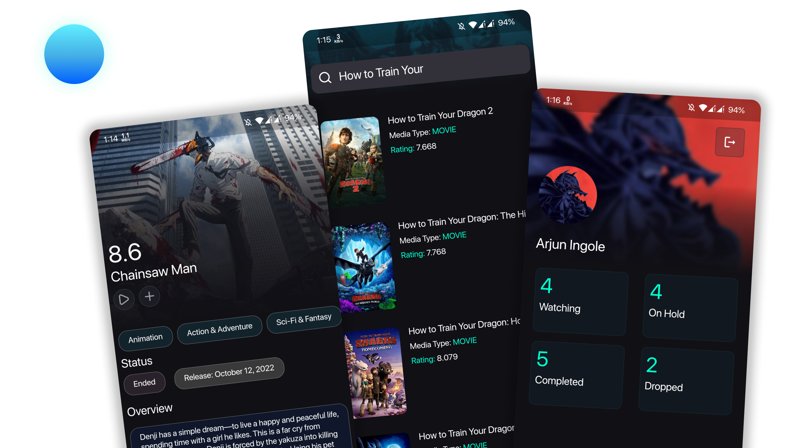

<div align = "center">
<div style="border-radius: 10%; overflow: hidden; width: 120px; height: 120px;">
  
</div>
<h1 align ="center"><b>Osiris</b></h1>
</div>

<div align = "center"> 
 </img>
 </img>
</div>
<br>

Osiris is a powerful movie and show tracker app built using Flutter, Firebase, and The Movie Database (TMDb) API. With Osiris, you can easily keep track of your favorite movies and TV shows, discover new ones, and stay up-to-date with the latest releases. The app provides a seamless user experience with a beautiful interface and efficient data synchronization using Firebase.



## Features

- User Authentication: Osiris allows users to sign up, log in, and securely authenticate their accounts using Firebase Authentication.

- Movie and TV Show Search: You can search for movies and TV shows using the extensive collection provided by The Movie Database (TMDb) API. Get detailed information about each title, including ratings, cast, synopsis, release date, and more.

- Personalized Watchlist: Easily add movies and TV shows to your watchlist to keep track of what you want to watch later.

- Discover New Content: Osiris offers personalized recommendations based on your watch history and preferences. Explore popular, trending, and upcoming movies and TV shows, and discover new content that matches your interests.

- Real-time Updates: Osiris provides real-time updates on movie and show releases, ensuring you never miss out on the latest entertainment.

- Data Synchronization: All your data, including watchlist, favorites, and ratings, are seamlessly synchronized across multiple devices using Firebase Cloud Firestore.

## Installation

To run Osiris locally, follow these steps:

1. Clone the repository:
```bash
git clone https://github.com/Arjun-Ingole/Osiris.git
```

2. Change to the project directory:
```bash
cd Osiris
```
3. Install the dependencies:
```bash
flutter pub get
```
4. Set up Firebase:

- Create a new Firebase project at [Firebase Console](https://console.firebase.google.com/).
- Add an Android and/or iOS app to your project and follow the setup instructions to obtain the necessary configuration files (google-services.json and/or GoogleService-Info.plist).
- Enable Firebase Authentication and Firestore in your Firebase project.

5. Configure TMDb API:
- Sign up for a free account at The Movie Database and obtain an API key.
- Add your API key to the lib/Services/key.dart file:
```dart
String api_key = "XXXXXXXXXXXXXXXXXXXXXXXXXXXXXX";
```

6. Run the app:
```bash
flutter run
```

## Technologies Used

- Flutter: A cross-platform UI toolkit for building beautiful, natively compiled applications.
- Firebase: A comprehensive suite of cloud-based tools for building and managing apps.
- The Movie Database (TMDb) API: A rich movie and TV show database with detailed information and media content.


## Screenshots


## License

Osiris is licensed under the MIT License. See LICENSE for more information.
